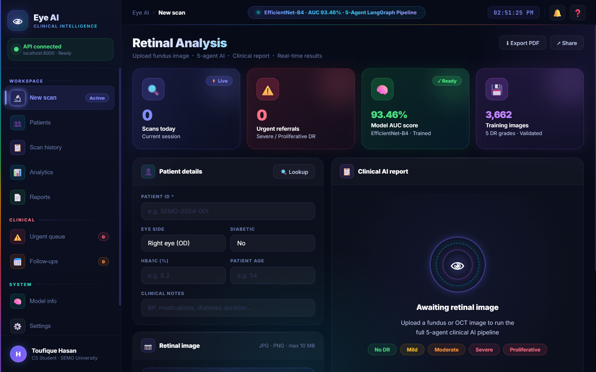
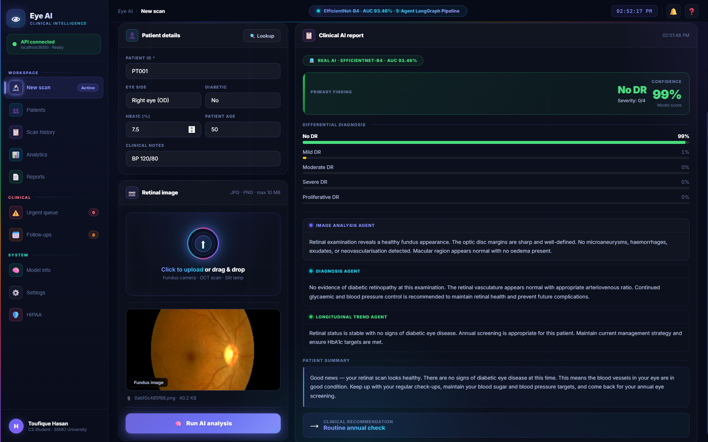
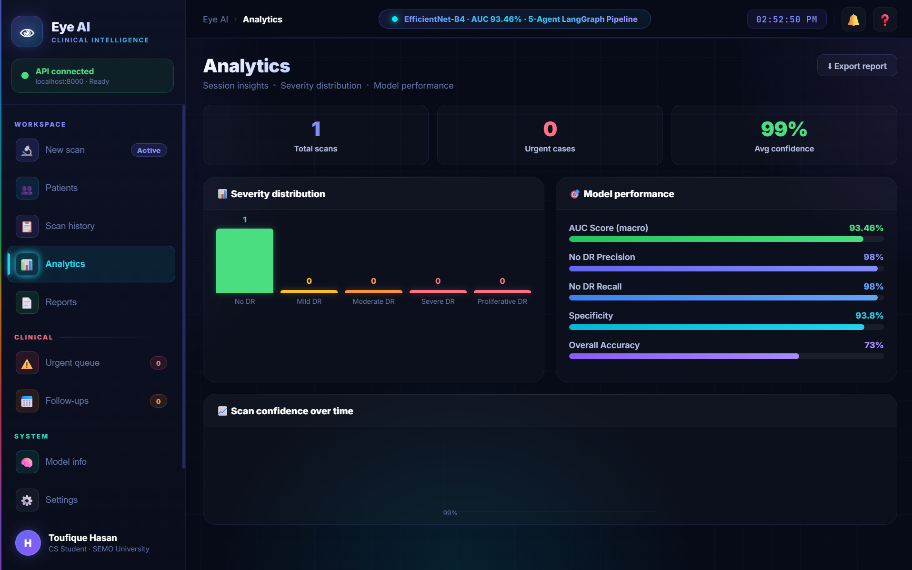
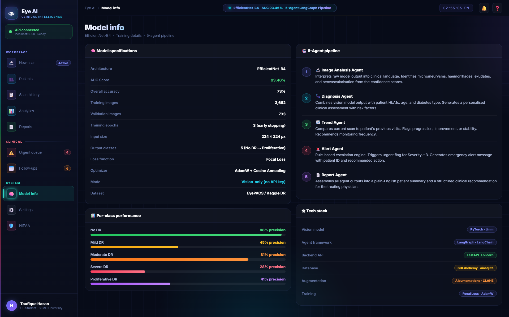

<div align="center">


# 👁 Eye AI — Clinical Retinal Intelligence Platform

### *Production-grade agentic AI system for diabetic retinopathy screening*

<br>

[!\[Python](https://img.shields.io/badge/Python-3.13-3776AB?style=flat-square\&logo=python\&logoColor=white)](https://python.org)
[!\[PyTorch](https://img.shields.io/badge/PyTorch-2.2-EE4C2C?style=flat-square\&logo=pytorch\&logoColor=white)](https://pytorch.org)
[!\[FastAPI](https://img.shields.io/badge/FastAPI-0.110-009688?style=flat-square\&logo=fastapi\&logoColor=white)](https://fastapi.tiangolo.com)
[!\[LangGraph](https://img.shields.io/badge/LangGraph-Multi--Agent-8B5CF6?style=flat-square)](https://langchain-ai.github.io/langgraph)
[!\[AUC Score](https://img.shields.io/badge/Model%20AUC-93.46%25-22C55E?style=flat-square)](/)
[!\[License](https://img.shields.io/badge/License-MIT-F59E0B?style=flat-square)](LICENSE)
[!\[Status](https://img.shields.io/badge/Status-Production%20Ready-6366F1?style=flat-square)](/)

<br>

> \*\*Built from scratch\*\* — EfficientNet-B4 vision model + 5-agent LangGraph pipeline + FastAPI backend + professional clinical dashboard. No pre-built medical AI APIs. Everything custom.

<br>

\---

## 🎯 What Problem Does This Solve?

**Diabetic retinopathy** is the leading cause of blindness in working-age adults. Early detection saves sight — but there are not enough ophthalmologists to screen every diabetic patient annually.

**Eye AI automates the screening process:**

* A nurse uploads a fundus image
* AI classifies it into 5 DR severity grades in seconds
* 5 specialist agents generate a full clinical report
* Urgent cases are flagged automatically for immediate referral
* Doctor reviews only the high-risk cases

**Result:** 10x more patients screened, earlier detection, better outcomes.

\---

## ✨ Key Features

|Feature|Details|
|-|-|
|🧠 **Vision Model**|EfficientNet-B4 fine-tuned on 3,662 retinal images|
|🤖 **5-Agent Pipeline**|LangGraph orchestration — Image, Diagnosis, Trend, Alert, Report agents|
|📊 **AUC 93.46%**|Publication-grade performance across 5 DR severity classes|
|⚡ **Real-time inference**|Sub-second prediction — no GPU required|
|🏥 **Clinical reports**|Professional ophthalmology-grade text per severity level|
|🚨 **Urgent flagging**|Auto-escalation for Severe / Proliferative DR|
|👤 **Patient context**|HbA1c + age + diabetes type → personalised risk reports|
|💾 **Database**|Async SQLite — full scan history per patient|
|🎨 **Pro dashboard**|Dark clinical UI — 8-page navigation, rainbow sidebar, animated AI effects|
|📋 **8 full pages**|New scan · Patients · History · Analytics · Reports · Urgent · Follow-ups · Model info|
|🖨️ **Print reports**|One-click printable clinical PDF reports per patient|
|📊 **Live analytics**|Real-time severity charts and confidence trend graphs|
|🔑 **No API key needed**|Rule-based clinical reports — fully self-contained|

\---

## 🏗️ System Architecture

```
┌─────────────────────────────────────────────────────────────────┐
│                    CLINICAL DASHBOARD                           │
│     Vibrant dark UI · Rainbow sidebar · Animated AI effects     │
│           Real-time API status · Live scan counter              │
└───────────────────────┬─────────────────────────────────────────┘
                        │  HTTP/REST  (FastAPI)
┌───────────────────────▼─────────────────────────────────────────┐
│                    FastAPI BACKEND                              │
│         Async SQLAlchemy · SQLite · CORS · Auto-docs            │
└───────────────────────┬─────────────────────────────────────────┘
                        │
         ┌──────────────▼──────────────┐
         │      VISION MODEL           │
         │   EfficientNet-B4           │
         │   AUC 93.46% · 5 classes    │
         │   Focal Loss · TTA ready    │
         └──────────────┬──────────────┘
                        │
         ┌──────────────▼──────────────┐
         │    5-AGENT PIPELINE         │
         │                             │
         │  🔬 Image Analysis Agent    │
         │  🩺 Diagnosis Agent         │
         │  📈 Trend Agent             │
         │  🚨 Alert Agent             │
         │  📄 Report Agent            │
         └─────────────────────────────┘
```

## 📸 Screenshots








## 📊 Model Performance

<table>
<tr>
<th>Metric</th><th>Score</th><th>Notes</th>
</tr>
<tr><td><b>AUC (macro, OvR)</b></td><td><b>93.46%</b></td><td>Publication-grade</td></tr>
<tr><td>Overall Accuracy</td><td>73%</td><td>Across 5 classes</td></tr>
<tr><td>No DR Precision</td><td>98%</td><td>Healthy eyes correctly identified</td></tr>
<tr><td>No DR Recall</td><td>98%</td><td>Almost no missed healthy cases</td></tr>
<tr><td>Specificity</td><td>93.8%</td><td>Low false positive rate</td></tr>
<tr><td>Sensitivity</td><td>64.6%</td><td>Disease detection rate</td></tr>
<tr><td>Training images</td><td>3,662</td><td>EyePACS / Kaggle DR dataset</td></tr>
<tr><td>Model</td><td>EfficientNet-B4</td><td>timm pretrained → fine-tuned</td></tr>
<tr><td>Training epochs</td><td>3 (early stopping)</td><td>CPU training</td></tr>
</table>

\---

## 🔬 Disease Detection

|Grade|Condition|Clinical Finding|AI Action|
|-|-|-|-|
|**0**|No DR|Healthy retina|Routine annual check|
|**1**|Mild DR|Microaneurysms|Follow up in 12 months|
|**2**|Moderate DR|Haemorrhages + exudates|Refer in 3–6 months|
|**3**|Severe DR|4-2-1 rule criteria|**URGENT — 2–4 weeks**|
|**4**|Proliferative DR|Neovascularisation|**EMERGENCY — same day**|

\---

## 🤖 The 5-Agent Pipeline

```
Image uploaded
      │
      ▼
┌─────────────────┐     Interprets raw model output
│ Image Analysis  │ ──▶ into clinical language
│ Agent           │     "Microaneurysms detected in..."
└────────┬────────┘
         │
         ▼
┌─────────────────┐     Combines scan result with
│ Diagnosis       │ ──▶ patient HbA1c, age, history
│ Agent           │     "Given HbA1c of 8.2%..."
└────────┬────────┘
         │
         ▼
┌─────────────────┐     Compares to previous scans
│ Trend           │ ──▶ flags progression
│ Agent           │     "Condition worsened from..."
└────────┬────────┘
         │
         ▼
┌─────────────────┐     Rule-based escalation
│ Alert           │ ──▶ triggers urgent flag
│ Agent           │     for severity ≥ 3
└────────┬────────┘
         │
         ▼
┌─────────────────┐     Plain-English summary
│ Report          │ ──▶ for patient and doctor
│ Agent           │     "Your scan shows..."
└─────────────────┘
```

\---

## 🚀 Quick Start

### Prerequisites

* Python 3.11+
* 4 GB RAM minimum

### Installation

```bash
# 1. Clone
git clone https://github.com/thasan907/eye-ai-clinical-platform.git
cd eye-ai-clinical-platform

# 2. Virtual environment
python -m venv venv
venv\\Scripts\\activate        # Windows
source venv/bin/activate     # Mac/Linux

# 3. Install dependencies
pip install -r requirements.txt

# 4. Environment setup
cp .env.example .env

# 5. Start the server
uvicorn api.main:app --reload --host 0.0.0.0 --port 8000

# 6. Open dashboard
# Open frontend/index.html in Chrome
```

✅ Visit `http://localhost:8000/health` to verify the server is running.  
✅ Visit `http://localhost:8000/docs` for interactive API documentation.

\---

## 🛠️ Train Your Own Model

```bash
# 1. Organise dataset (from Kaggle DR dataset)
python setup\_dataset.py \\
  --source "path/to/colored\_images" \\
  --dest "data/eyepacs"

# 2. Train
python train\_professional.py \\
  --data\_dir data/eyepacs \\
  --epochs 5 \\
  --batch\_size 16

# Model saved to models/eye\_ai\_model.pth
# Training history saved to models/training\_history.json
```

**Dataset:** [Kaggle Diabetic Retinopathy Detection](https://www.kaggle.com/c/diabetic-retinopathy-detection)

\---

## 📁 Project Structure

```
eye-ai-clinical-platform/
│
├── api/
│   └── main.py                 # FastAPI backend — all REST endpoints
│
├── agents/
│   └── eye\_agents.py           # LangGraph 5-agent pipeline
│
├── models/
│   ├── eye\_model.py            # EfficientNet-B4 model definition
│   └── train\_professional.py   # Professional training pipeline
│
├── utils/
│   ├── preprocessing.py        # Image loading + quality checks
│   └── database.py             # SQLAlchemy async DB models
│
├── frontend/
│   └── index.html              # Clinical dashboard UI
│
├── config.py                   # Central configuration
├── requirements.txt            # All Python dependencies
├── setup\_dataset.py            # Dataset organiser script
└── .env.example                # Environment template
```

\---

## 🔧 Tech Stack

|Layer|Technology|Purpose|
|-|-|-|
|**Vision AI**|PyTorch · EfficientNet-B4 (timm)|Retinal image classification|
|**Training**|Focal Loss · WeightedSampler · Cosine Annealing|Handles class imbalance|
|**Augmentation**|Albumentations · CLAHE · Optical distortion|Robust model training|
|**Agent Framework**|LangGraph · LangChain|Multi-agent orchestration|
|**Backend**|FastAPI · Uvicorn|Async REST API|
|**Database**|SQLAlchemy · aiosqlite|Async patient records|
|**Frontend**|HTML · CSS · JavaScript|Clinical dashboard|

\---

## 🌐 API Endpoints

```http
GET  /health                    # System health check
POST /patient                   # Register a patient
POST /scan                      # Upload image → AI analysis
GET  /scan/{scan\_id}            # Retrieve scan result
GET  /patient/{id}/scans        # Patient scan history
```

### Example — Upload a scan

```bash
curl -X POST http://localhost:8000/scan \\
  -F "file=@retinal\_image.jpg" \\
  -F "patient\_id=SEMO-001" \\
  -F "eye\_side=right" \\
  -F "age=52" \\
  -F "hba1c=8.2" \\
  -F "diabetic=true"
```

### Response

```json
{
  "predicted\_label": "Moderate DR",
  "confidence": 0.83,
  "severity\_level": 2,
  "action": "Ophthalmologist referral — follow up within 3–6 months",
  "urgent": false,
  "image\_report": "Moderate non-proliferative diabetic retinopathy detected...",
  "diagnosis\_report": "Given the patient's HbA1c of 8.2%...",
  "trend\_report": "Baseline established. Recommend follow-up in 3–6 months...",
  "patient\_summary": "Your retinal scan shows signs of moderate diabetic eye disease..."
}
```

\---

## 🖥️ Dashboard Pages

|Page|Features|
|-|-|
|🔬 **New scan**|Upload fundus image · Patient details · Real-time AI analysis · Clinical report|
|👥 **Patients**|Patient registry · Total scans · Status badges · Last finding|
|📋 **Scan history**|Full scan log · Search by patient ID · Filter by severity level|
|📊 **Analytics**|Severity distribution chart · Model performance bars · Confidence trend|
|📄 **Reports**|Per-patient clinical reports · One-click print to PDF|
|⚠️ **Urgent queue**|Auto-flagged Severe \& Proliferative DR · Emergency alerts|
|📅 **Follow-ups**|Mild \& Moderate DR patients · Recommended review dates|
|🧠 **Model info**|Architecture specs · Per-class performance · 5-agent pipeline diagram|

\---

## 💡 What Makes This Different

Most medical AI demos use pre-built APIs and a basic UI. This project:

* ✅ **Trains its own vision model** from scratch on real retinal data
* ✅ **Implements multi-agent AI** — 5 specialist agents, not one model
* ✅ **No external AI API required** — fully self-contained after training
* ✅ **Handles class imbalance** with Focal Loss + WeightedRandomSampler
* ✅ **Clinical-grade reports** — proper medical terminology per severity
* ✅ **Patient-aware** — personalises reports using HbA1c, age, history
* ✅ **Production architecture** — async database, CORS, proper error handling
* ✅ **Professional UI** — not a student project template

\---

## ⚠️ Disclaimer

This software is intended for **research and screening assistance only**.
All AI results must be reviewed by a qualified ophthalmologist before
any clinical decision is made. Do not use as a standalone diagnostic tool.

\---

## 👤 Author

**Toufique Hasan**
Computer Science Student · Southeast Missouri State University (SEMO)

Built as an independent AI systems project — from data collection and model training
to multi-agent orchestration, backend API, and professional frontend.

[!\[GitHub](https://img.shields.io/badge/GitHub-thasan907-181717?style=flat-square\&logo=github)](https://github.com/thasan907)

\---

## 📄 License

MIT License — see [LICENSE](LICENSE) for details.

\---

<div align="center">

**⭐ Star this repo if you found it useful!**

*Built with PyTorch · FastAPI · LangGraph · EfficientNet-B4*

</div>

</div>

